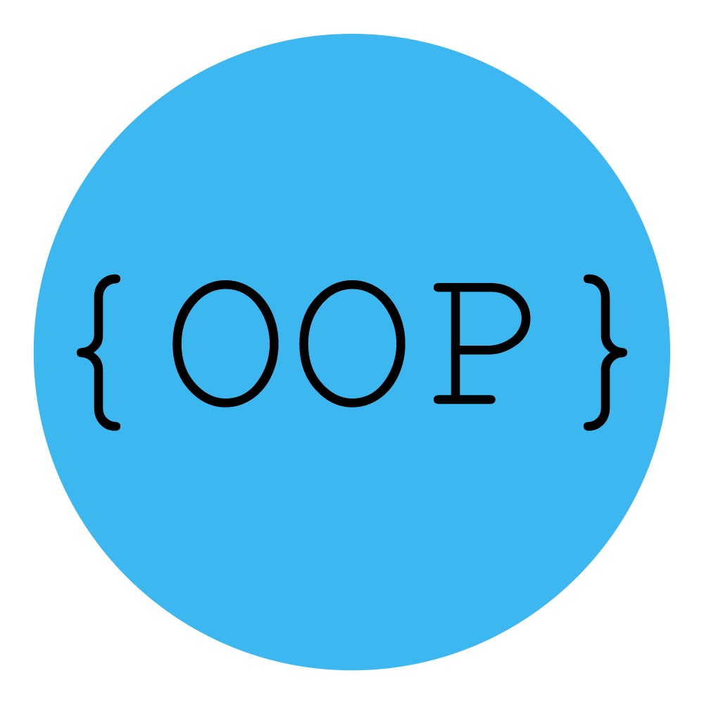

<h2 align="center">Hi 👋! My name is Yousef Saeed and I'm a Frontend Developer, from Cairo</h2>

###

<!--   
   -->
<!-- 
 -->

  

###

  

<h2 align="left">🌐 Connect with me:</h2>

  
  
  
  
  

<h2 align="left">🛠️ Languages & Tools:</h2>

  
  
  
  
  
  
  
  
  
  
  
  
  
  
  
  
  
  
  
  
  
  
  
  
  
  
  
  
  
  
  
  
  

 

 

