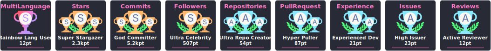

<h2 align="center">Hi 👋! My name is Yousef Saeed</h2>

  <svg width="850" height="250" viewBox="0 0 850 250" fill="none" xmlns="http://www.w3.org/2000/svg">
    

    <rect width="850" height="250" rx="15" fill="#0d1117"/>
    <rect width="850" height="250" rx="15" fill="url(#paint0_linear)" fill-opacity="0.2"/>
    
    <g class="profile-circle">
      <defs>
        <clipPath id="circleView">
          <circle cx="150" cy="125" r="70" />
        </clipPath>
      </defs>
      <image clip-path="url(#circleView)" x="80" y="55" width="140" height="140" href="output/Me.png" />
      <circle cx="150" cy="125" r="72" stroke="#30363d" stroke-width="2"/>
    </g>

    <g class="fade-in" style="font-family: 'Segoe UI', Tahoma, Geneva, Verdana, sans-serif;">
      <text x="280" y="110" fill="#ffffff" font-size="28" font-weight="bold">Youssef Saeed</text>
      
      <foreignObject x="280" y="125" width="500" height="50">
        

          
Full Stack Developer | React, Next.js & Node.js

        

      </foreignObject>

      <text x="280" y="180" fill="#58a6ff" font-size="14">📧 email@example.com</text>
      <text x="450" y="180" fill="#58a6ff" font-size="14">📱 +20 123 456 7890</text>
    </g>

    <defs>
      <linearGradient id="paint0_linear" x1="0" y1="0" x2="850" y2="250" gradientUnits="userSpaceOnUse">
        <stop stop-color="#58a6ff"/>
        <stop offset="1" stop-color="#bc85ff"/>
      </linearGradient>
    </defs>
  </svg>

<h3 align="center">Full-Stack (MERN) Developer | React & Next.js | Backend: Node.js (Express & Nest.js) | DB: MongoDB & PostgreSQL</h3>

### 

  <table border="0">
    <tr>
      <td>
        
      </td>
      <td>
        
      </td>
    </tr>
  </table>

### 

### 

  

### 

<h2 align="left">🌐 Connect with me:</h2>

  
  
  
  
  

<h2 align="left">🎨 Frontend Skills:</h2>

  
    
  
  &nbsp;
  
  &nbsp;
  

<h2 align="left">🖥️ Backend Skills:</h2>

  
    
  

<h2 align="left">🛠️ Tools:</h2>

  

### 

  

### 

 

 

