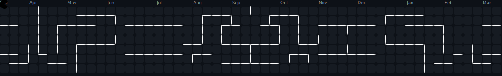

  

  

  

  

### 👨‍💻 About Me

- 🔭 I’m currently building scalable web applications using the **MERN stack** and **Next.js**.
- 🌱 I recently graduated from the **DEPI 6-Month Scholarship** (React, Node.js, Docker) and the **NTI MEAN Stack** training track.
- 💡 I love developing systems with clean code, robust backend authentication, and seamless frontend experiences.
- 💬 Ask me about: **React, Next.js, Express, NestJS, MongoDB, PostgreSQL**.
- 📫 Reach out to me: **[saeedyoussef219@gmail.com](mailto:saeedyoussef219@gmail.com)**

---

### 🛠️ Tech Stack & Tools

  <h4>Frontend Development</h4>
  

  <h4>Backend Development & Databases</h4>
  

  <h4>Tools & Workflow</h4>
  

<h2 align="left">🚀 Featured Deployments (The Tech Portfolio):</h2>

<table border="0" cellpadding="0" cellspacing="10" width="100%">
  <tr>
    <td width="50%" valign="top">
      

        
         
        

          Full-stack web application built with React, Express, Stripe Payments, and MongoDB.
        

        

          
          
          
        

         
        
        
      

    </td>
    <td width="50%" valign="top">
      

        
         
        

          Frontend-focused E-commerce platform built with React, state management, and API integration.
        

        

          
          
        

         
        
        
      

    </td>
  </tr>
  <tr>
    <td width="50%" valign="top">
      

        
         
        

          Backend API built with NestJS and PostgreSQL, featuring authentication and clean architecture.
        

        

          
          
        

         
        
        
      

    </td>
    <td width="50%" valign="top">
      

        
         
        

          Online book store backend using Node.js, Express, and MongoDB with REST API endpoints.
        

        

          
          
          
        

         
        
        
      

    </td>
  </tr>
</table>

---

### 🌐 Connect With Me

 

  

