<h2 align="center">Hi 👋! My name is Yousef Saeed</h2>

<h3 align="center">Full-Stack (MERN) Developer | React & Next.js | Backend: Node.js (Express & Nest.js) | DB: MongoDB & PostgreSQL</h3>

### 

  
  
  <h1>Hi 👋, I'm Youssef Saeed</h1>
  <h3>Professional Full-Stack Developer</h3>

  

    
    
    
    
    
  

  ---

  <table border="0">
    <tr>
      <td>
        
      </td>
      <td>
        
      </td>
    </tr>
  </table>

  ---

  

    🚀 <b>About Me:</b> 
    Experienced Full-Stack Developer building scalable applications using Node.js, Express, NestJS, React, Next.js, MongoDB, and PostgreSQL. I'm passionate about clean code and modern system design.
  

  

    
    
    
  

### 

### 

  

### 

<h2 align="left">🌐 Connect with me:</h2>

  
  
  
  
  

<h2 align="left">🎨 Frontend Skills:</h2>

  
    
  
  &nbsp;
  
  &nbsp;
  

<h2 align="left">🖥️ Backend Skills:</h2>

  
    
  

<h2 align="left">🛠️ Tools:</h2>

  

### 

  

### 

 

 

